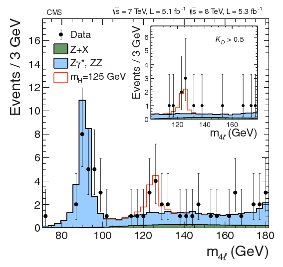

# Level 1 — Qualitative replication

The replication is organized in four levels.  
**Level 1** focuses on a *qualitative comparison* between **Figure 2** from the original CMS publication and **Figure 3** generated using the CERN Open Data example.  
The goal is to observe the similarities and differences in **shape, scale, and data interpretation**.

Both figures display the **invariant mass distribution of four leptons (4ℓ)**, which represents the key decay channel for detecting the Higgs boson through the process **H → ZZ → 4ℓ**.  
In both cases, the center-of-mass energy is **7 TeV** and **8 TeV**, corresponding to the operational conditions of the **Large Hadron Collider (LHC)** during the 2011–2012 data-taking period.

However, the **total integrated luminosity** differs:  
- The original CMS publication (Figure 1) uses the **full dataset** collected in 2011–2012, approximately **5 fb⁻¹**.  
- The **Open Data version** (Figure 2) uses a smaller and simplified subset of data with only partial signal simulation.

Integrated luminosity measures the **total number of collisions**, and directly affects the number of detected events.  
Consequently, the Open Data plot contains **fewer statistics** and a less pronounced signal peak.

---

### Original CMS plot (Figure 1)

  

*Distribution of the four-lepton invariant mass (H → ZZ → 4ℓ) from the CMS publication.*

---

### Replicated Open Data plot (Figure 2)

  

*Result obtained using Monte Carlo–based Open Data inputs.*

---

In the official CMS diagram, the **background contributions** are precisely modeled and include **experimental uncertainties**, while in the Open Data version they are **simplified**.  
Despite this, the Open Data plot still reveals a **characteristic bump around 125 GeV**, indicating the presence of the Higgs boson.

This demonstrates that even with limited datasets and simplified methods, it is possible to reproduce the **approximate shape of the original result**.  
