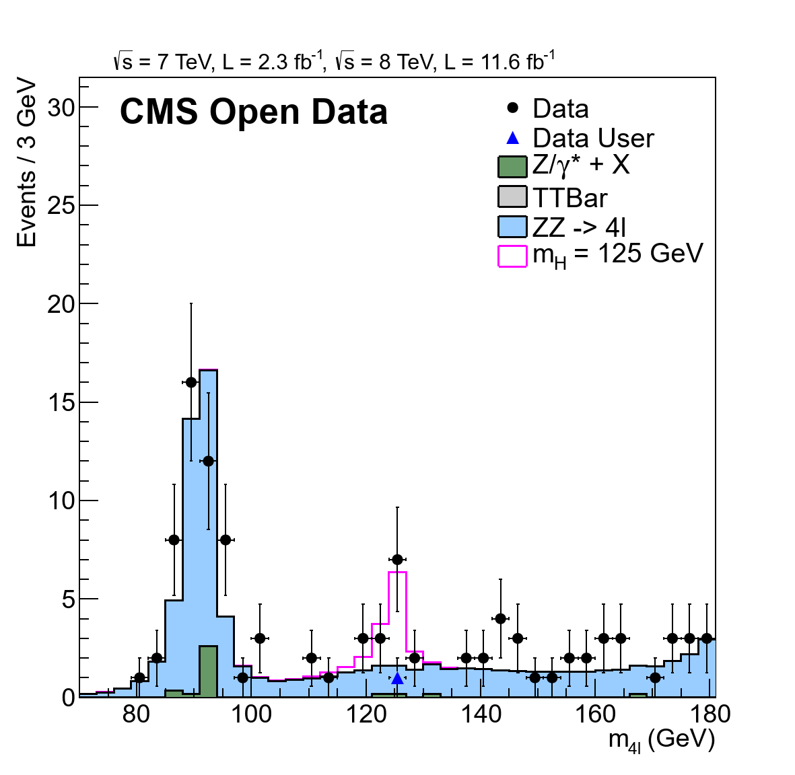

# Level 3 — Generating custom ROOT files from raw Open Data

Level 3 represents a more advanced stage of the replication process.  
The main goal is to **generate your own ROOT files** directly from **raw experimental and simulated data** available on the [CERN Open Data portal](https://opendata.cern.ch).  
Unlike Level 2, where preprocessed histograms were used, this stage allows you to **run your own data processing and event selection**, strengthening the understanding of the full analytical workflow.

---

## Overview

Two main datasets are processed in this level:

- **Experimental data:** contains one selected Higgs boson candidate event from the 2012 dataset.  
- **Monte Carlo simulations:** represent the Higgs signal with reduced statistics for faster processing and testing.

The work is performed inside the **CMS Open Data Virtual Machine** with **CMSSW 5_3_32**, ensuring compatibility with previous levels.  
Although validation steps (Test & Validation) can be performed, they were skipped here for simplicity — without affecting the main results.

---

## Step 1 — Setting up the environment

> ⚠️ **Important:**  
> All commands must be executed **inside the CMS Shell** within the **CMS Open Data Virtual Machine**.  
> Running them in a standard terminal will not work because required environment variables and dependencies will be missing.

```bash
# Navigate to CMSSW environment
cd ~/CMSSW_5_3_32/src

# Create working directory for the analyzer
mkdir -p Demo/DemoAnalyzer
cd Demo/DemoAnalyzer

# Download the build configuration file
wget https://opendata.web.cern.ch/record/5500/files/BuildFile.xml
```

---

## Step 2 — Getting and compiling the analyzer

Download and compile the **HiggsDemoAnalyzer** C++ source code:

```bash
# Create src directory and download analyzer code
mkdir src && cd src
wget https://opendata.web.cern.ch/record/5500/files/HiggsDemoAnalyzer.cc

# Compile
cd ..
scram b
```

The **HiggsDemoAnalyzer** program is responsible for processing raw CMS events, applying selection cuts, and writing output to new ROOT files.

---

## Step 3 — Downloading the configuration and JSON files

Fetch the Python configuration scripts for data and Monte Carlo runs:

```bash
wget https://opendata.web.cern.ch/record/5500/files/demoanalyzer_cfg_level3data.py
wget https://opendata.web.cern.ch/record/5500/files/demoanalyzer_cfg_level3MC.py
```

Create a dataset directory for the certification (JSON) file, which ensures only high-quality detector data are used:

```bash
mkdir datasets && cd datasets
wget https://opendata.web.cern.ch/record/1002/files/Cert_190456-208686_8TeV_22Jan2013ReReco_Collisions12_JSON.txt
cd ..
```

The **JSON file** filters events to include only those recorded under optimal detector conditions, increasing data quality.

---

## Step 4 — Running the analysis

Run both configurations to produce your own ROOT output files:

```bash
cmsRun demoanalyzer_cfg_level3data.py
cmsRun demoanalyzer_cfg_level3MC.py
```

After execution, two new ROOT files will be created:

- `DoubleMuParked2012C_10000_Higgs.root` — contains one Higgs candidate from real data  
- `Higgs4L1file.root` — contains Monte Carlo–simulated Higgs decays with limited statistics

Move them into the rootfiles directory for visualization:

```bash
mv Higgs4L1file.root ../../rootfiles/
mv DoubleMuParked2012C_10000_Higgs.root ../../rootfiles/
cd ../../rootfiles
```

---

## Step 5 — Visualizing results

Download and execute the Level 3 plotting macro:

```bash
wget https://opendata.web.cern.ch/record/5500/files/M4Lnormdatall_lvl3.cc
root -l M4Lnormdatall_lvl3.cc
```

This updated macro loads the newly created ROOT files and generates a **four-lepton invariant mass distribution**.  
In the resulting plot:

- The **Higgs candidate from real data** is marked with a **blue triangle**.  
- Simulated data and background processes are shown as stacked histograms.  

<p align="center">
  
</p>

*Resulting four-lepton invariant mass distribution (H → ZZ → 4ℓ) with the identified Higgs candidate at ~125 GeV.*

---

## Outcome and interpretation

Level 3 extends the previous analysis by working directly with **raw Open Data** instead of precomputed histograms.  
The result confirms the presence of the **Higgs candidate event** near 125 GeV, consistent with the Standard Model expectation.  
This level demonstrates that independent researchers and students can fully **reproduce the CMS workflow**, from raw data processing to visualization, using publicly available datasets and tools.

---

### Next step
Continue to [Level 4 →](../level_4/README.md), where the analysis is parallelized and distributed across multiple **CernVM** instances on **Google Cloud Platform (GCP)**.
**OR**
Continue to [Level 3 Code Explanation →](./level_3_code.md), where there’s a detailed explanation of the **Python** and **C++** files used in this stage.  
The same code will be reused in **Level 4**, making this section especially useful for understanding the structure and logic behind the analysis workflow.
