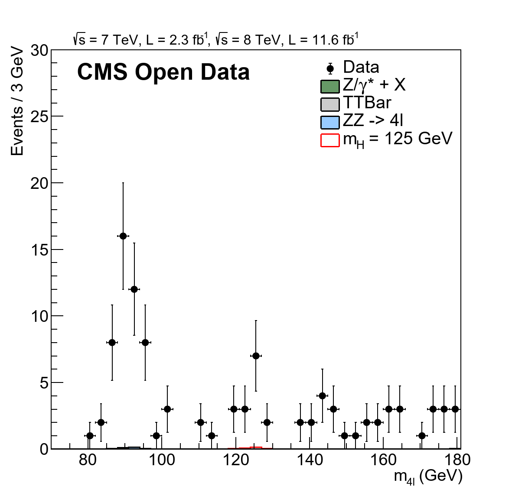
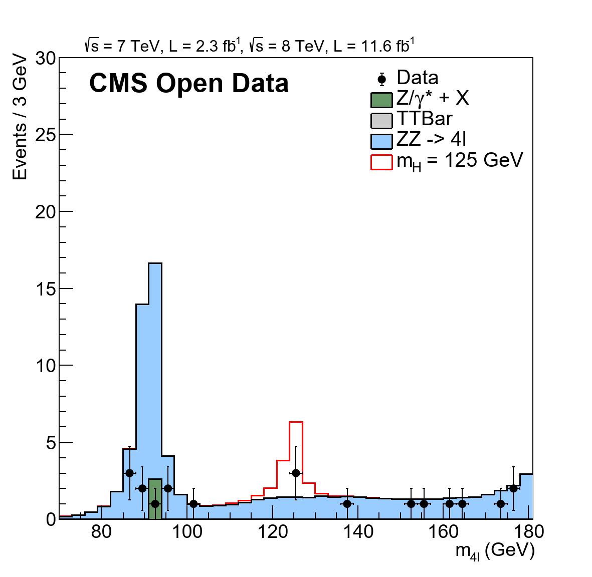
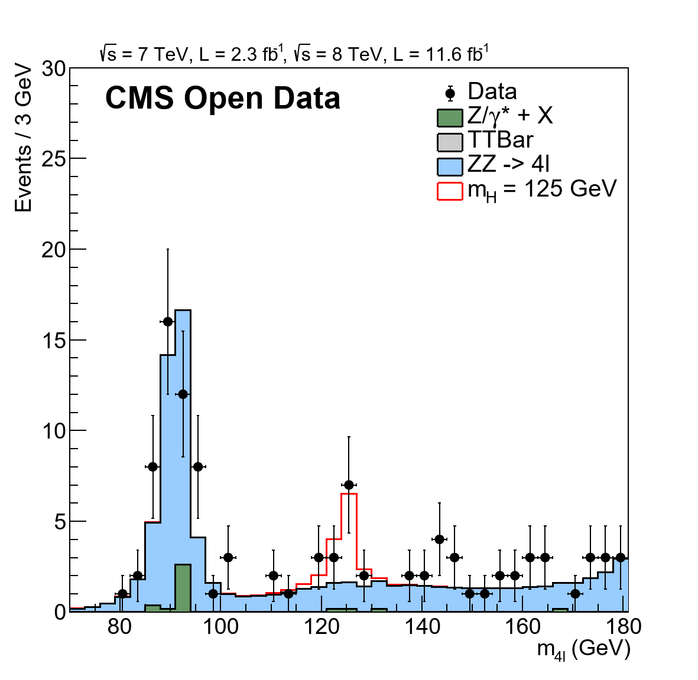

# Level 4 — End‑to‑end, parallelized analysis on CernVM + Google Cloud

Level 4 demonstrates the **full pipeline** — from reading large input datasets to producing the final histograms — and shows how to **parallelize** the work across many virtual machines (VMs) using **CernVM on Google Cloud Platform (GCP)**.

> [!NOTE]
> The following README provides a **general summary and explanation** of **Level 4** — its purpose, structure, and results.  
> For a detailed **step-by-step walkthrough** (including commands, setup, and GCP deployment), see the [**Level 4 Tutorial Guide →**](./level_4_tutorial.md).

> [!WARNING] 
> Google Cloud imposes **default quotas** on resources such as CPUs, VM instances, and external IPs.  
> These limits may vary by **region**, **project**, and **account type**.  
> Before launching multiple CernVM instances, check your available quotas in the [Google Cloud Console →](https://console.cloud.google.com/iam-admin/quotas) and **adjust your configuration accordingly**.  
> If needed, request quota increases in advance to ensure all instances can be deployed successfully.


---

## What’s different at Level 4?

Earlier levels validated individual pieces (plots, macros, small inputs). Here we **connect all steps** into a single, scalable workflow:

- Use **index files** (lists of ROOT files) to represent big datasets.
- Drive the analysis via **CMSSW configs** (`demoanalyzer_cfg_level4data.py`, `demoanalyzer_cfg_level4MC.py`).
- Distribute work across **multiple CernVM instances** on **GCP**.
- Merge outputs and reproduce the **four‑lepton mass** distributions.

> Due to partial public availability of some **MC samples**, missing pieces are supplemented with pre‑generated results from earlier levels, preserving continuity of the method.

---

## Inputs at scale: index files

An *index file* is a plain text list of ROOT files for one dataset. Instead of listing thousands of files by hand, the config loads a single index file and hands all entries to CMSSW’s `PoolSource`.

**Example:** `_DoubleElectron_Run2011A-12Oct2013-v1_AOD.txt` contains **1,697** ROOT files, covering **49,693,737** events.

In `demoanalyzer_cfg_level4*.py`, inputs are loaded with `FileUtils.loadListFromFile` and passed to `PoolSource`:

```python
from FWCore.PythonUtilities import FileUtils
files2012data = FileUtils.loadListFromFile('/home/cms-opendata/CMSSW_5_3_32/src/Demo/DemoAnalyzer/datasets/_DoubleElectron_Run2011A-12Oct2013-v1_AOD.txt')

process.source = cms.Source(
    "PoolSource",
    fileNames = cms.untracked.vstring(*files2012data)
)
```

This keeps the workflow **scalable** (tens of millions of events) and **transparent** (inputs are documented and reproducible).

---

## Auto‑generating index files

Use a helper script in Cloud Shell to generate index files from dataset titles with **cernopendata‑client** (xrootd locations):

```bash
#!/usr/bin/env bash
set -euo pipefail

INPUT_FILE="List_indexfile.txt"
OUTPUT_DIR="indexfiles"
mkdir -p "$OUTPUT_DIR"

while IFS= read -r DATASET_PATH; do
  [[ -z "$DATASET_PATH" || "${DATASET_PATH:0:1}" != "/" ]] && continue
  SAFE_NAME=$(echo "$DATASET_PATH" | tr '/ ' '__')
  echo "Fetching file locations for: $DATASET_PATH"
  cernopendata-client get-file-locations     --title "$DATASET_PATH"     --protocol xrootd     &> "$OUTPUT_DIR/${SAFE_NAME}.txt"
  echo "Saved: $OUTPUT_DIR/${SAFE_NAME}.txt"
done < "$INPUT_FILE"
```

Place dataset titles (data + MC, 2011/2012) into `List_indexfile.txt`. The script writes one index file per dataset under `indexfiles/`.

---

## Throughput planning

From Level 3 benchmarking, the **average CPU time per event** is about **0.008732 s/event**. In **24 h** (86,400 s) a single VM can process roughly **9,894,640 events**.

- For a dataset with **49,693,737** events → **≈ 6 VMs** (round up conservatively).  
- Real‑world factors (JSON filters, I/O variation) reduce the effective event count, so **5 VMs** proved sufficient for that case.

Across all datasets in this level the plan called for **38 VMs** (≈ **23 data**, **15 MC**), adjusted to availability of public MC files.

---

## Preparing the CernVM image (GCP)

1. Import the official **CernVM** (v4.5) image into GCP and create a **machine image**.
2. Launch instances with a **user‑data (context) file** that:
   - Configures **CVMFS** and CMS environment (`SCRAM_ARCH=slc6_amd64_gcc472`).
   - Provides a `cms-shell` wrapper (Singularity) for an immediate CMS shell.
   - Defines **SITECONF** and **xrootd/EOS** access (LFN→PFN mappings, fallback redirectors).
   - Bootstraps the code and configs (downloads **HiggsDemoAnalyzer.cc**, Level 4 configs, and **JSON** luminosity masks).

> After boot, each VM is ready to compile and run Level 4 without manual setup.

### Network and security

- Instances are created **without public IPs** (private only).  
- **IAP tunnels** are used for SSH administration.  
- A **Cloud NAT** provides outbound internet (CVMFS, xrootd, package mirrors).

Example NAT setup (region‑scoped):

```bash
gcloud compute routers create nat-router --network=default --region=europe-central2
gcloud compute routers nats create nat-config   --router=nat-router --region=europe-central2   --nat-all-subnet-ip-ranges --auto-allocate-nat-external-ips
```

### Example VM creation loop

```bash
#!/usr/bin/env bash
VM_NAMES_FILE="vm-names"
PROJECT="mcsets-analisys-higgs-boson"
ZONE="europe-central2-a"
SERVICE_ACCOUNT="1234567890-compute@developer.gserviceaccount.com"
DISK_IMAGE="projects/<project>/global/images/cern-vm-08-10"
STARTUP_FILE="./cms-opendata-startup.context"

while read -r VM_NAME; do
  [[ -z "$VM_NAME" ]] && continue
  gcloud compute instances create "$VM_NAME"     --project="$PROJECT"     --zone="$ZONE"     --machine-type=e2-medium     --network-interface=network-tier=PREMIUM,stack-type=IPV4_ONLY,subnet=default,no-address     --service-account="$SERVICE_ACCOUNT"     --scopes=https://www.googleapis.com/auth/devstorage.read_only,https://www.googleapis.com/auth/logging.write,https://www.googleapis.com/auth/monitoring.write     --create-disk=auto-delete=yes,boot=yes,image="$DISK_IMAGE",mode=rw,size=20,type=pd-standard     --labels=project=cernvm-opendata,vm-name="$VM_NAME"     --metadata-from-file user-data="$STARTUP_FILE"
done < "$VM_NAMES_FILE"
```

---

## Level 4 CMSSW configs (data & MC)

The Level 4 configs read from **index files** and set **event ranges** per VM to avoid overlaps:

```python
# Process all, or cap per-VM capacity (≈ 9,894,640 events/24h)
process.maxEvents = cms.untracked.PSet(input = cms.untracked.int32(9894640))

# Split the dataset among VMs (example: 4th VM)
process.source.skipEvents = cms.untracked.uint32(3 * 9894640)
```

- **Data configs** keep **JSON** luminosity masks enabled.  
- **MC configs** skip JSON (not applicable to simulation).

Distribute different `skipEvents` values across VMs to partition the dataset.

---

## Running at scale

Start jobs with `nohup` to keep them running after you disconnect; write logs to a `.report` file:

```bash
nohup cmsRun demoanalyzer_cfg_level4data.py &> DoubleElectron_Run2011A.report &
```

Repeat per VM/dataset. When finished, copy back outputs (`.root` + `.report`) to a central node.

**Log hygiene:** Extract the first and last 200 lines of each report for quick inspection before transfer.

---

## Merging outputs and plotting

Merge all ROOT outputs with `hadd`, then update the input lists in your plotting macro (`M4Lnormdatall.cc`) and draw the **m4ℓ** distributions:

```bash
hadd -f results/histograms/merged.root results/histograms/*.root
root -l M4Lnormdatall.cc
```

### Variants compared

1. **MC‑only (generated here)** — shows gaps/instabilities when public MC is incomplete.  
<p align="center">
  
</p>
2. **Partial real data + MC** — illustrates fluctuations due to limited coverage.  
<p align="center">
  
</p>
3. **All generated real data + supplemented MC** — reproduces the expected reference shape (Higgs peak near **125 GeV**).
<p align="center">
  
</p>

Use comments/blocks in `M4Lnormdatall.cc` to switch between input sets (see listings in your thesis).

---

## Performance notes

Observed runtimes varied with network load (xrootd/EOS throughput). Early VMs often matched the nominal **0.0087 s/event**, later VMs slowed to **≈2×–3×** that value under contention.

Recommendations:

- Plan **conservatively** (buffers in time and VM count).  
- Balance datasets across zones/regions with active NAT.  
- Prefer VM types with stronger **network I/O** if available/budgeted.

---

## Cost considerations

The total cost for this replication (including prep and tests) exceeded **USD 500**. A large fraction was attributed to **networking**. Compute and storage were smaller contributors. Optimizing for network‑bound workloads can improve the **performance‑per‑dollar**.

---

### Outputs of Level 4

- Many per‑chunk ROOT files → **merged** into a single output.  
- Final plots from `M4Lnormdatall.cc` comparable to the Level 2 reference figure.  
- A documented, reproducible path from **dataset selection** → **distributed processing** → **final physics plots**.

---

##  Conclusion and what's next

The goal of this project was to **replicate the analysis of the Higgs boson decay into four leptons (H → ZZ → 4ℓ)** using **publicly available data** from the [CERN Open Data portal](https://opendata.cern.ch/).  
Through several replication levels, a **step-by-step methodological framework** was developed that made it possible to reproduce a complex CMS analysis in an **independent research environment**.

Level 4 was particularly significant, as it combined **large-scale data processing**, **distributed execution**, and **resource planning** across cloud infrastructure.  
This level showed that replication is not only a technical exercise — it’s an **organizational challenge** involving optimization of time, infrastructure, and cost.

### Key achievements
- Successfully processed tens of millions of events by defining **per-event runtime metrics** and using them to estimate **per-VM capacity**.  
- Deployed and managed **38 virtual machines** — 23 for real data and 15 for Monte Carlo simulations — achieving balance between scale and cost.  
- Demonstrated **uniform and reproducible environments** through **CernVM images** and **automated contextualization scripts**.  
- Validated that **public datasets** and **open-source tools** can yield scientifically reliable and reproducible results.  
- Overcame partial **MC dataset availability** by combining newly generated and previously processed data, maintaining histogram stability and consistency.  
- Confirmed that the **Higgs peak near 125 GeV** is reproducible even with limited MC coverage, proving the robustness of the method.

### Lessons learned
- **Planning and resource distribution** are critical when dealing with high-volume datasets — accurate time estimation directly affects quality and reproducibility.  
- **Automation** minimizes human error and ensures uniformity across many instances.  
- **Open data** enables meaningful research outside of large collaborations, but also requires **methodological flexibility** to compensate for missing samples.

### Recommendations
1. Always verify **dataset availability** before planning large analyses.  
2. Increase the use of **automation** (scripts, contextualization, orchestration tools).  
3. Extend the method to **other Higgs decay channels** and to **newer LHC datasets**.  
4. Consider testing **specialized VM types** optimized for network I/O to improve efficiency.

---

### Broader impact

This project confirms that **open science is not just a principle of transparency** — it is a **practical and effective model** for real-world research.  
By combining **CERN Open Data**, **CernVM**, and **Google Cloud**, it was shown that even complex high-energy physics analyses can be **reproduced, verified, and extended** outside the original CMS collaboration.

The work demonstrates that **distributed computing**, **automation**, and **open data** together form a sustainable foundation for future research in high-energy physics and beyond.

---

### Next steps

- Expand the replication framework to include **other decay channels** (e.g. H → γγ).  
- Automate **scaling and orchestration** using tools like **Terraform** or **Kubernetes** for future iterations.  
- Contribute improvements and documentation back to the **CERN Open Data community** to support future replications.

> **In summary:**  
> The analysis confirmed that **replicating the Higgs boson discovery using open data is fully achievable** — not only as a scientific proof of concept, but as a **practical demonstration of transparent, accessible, and reproducible science**.

